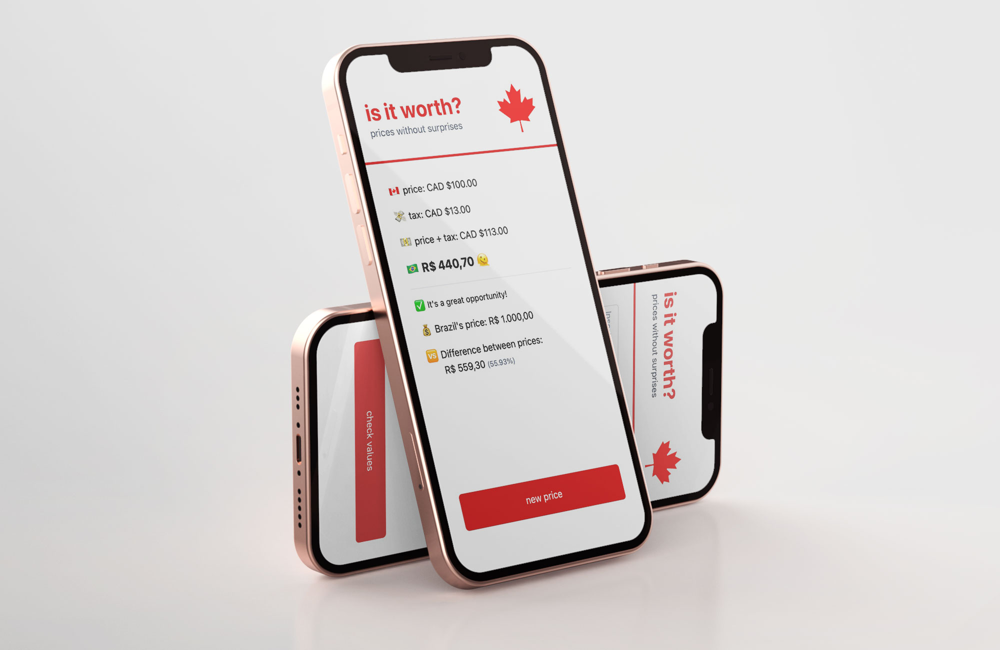

# Is it worth?

Prices without surprises

## About the project

🇨🇦 In english:

The project "It is worth?" it came from my month-long trip to Canada to get to know more of the country that I've always admired, but which i hadn't visited yet. When planning the trip, I always came up against the difference in values when converting the Brazilian Real into the Canadian Dollar (including provincial tax). This continued during the trip, when I received messages asking: "how much is this product buying there?".

In the beginning, the project was baptized as "How much?", as it would only be to know the final value of the purchase, since I always had to include the tax in the price (and sometimes the tip too).

The project envolved and gained more features, such as knowing whether that purchase, wich seemed very cheap compared to Brazil, would really be worth it, hence the name change to "Is it worth?".

Currently, the fees (taxes and tips) are fixed (the tax of province I visited - Ontario, 13% - and the most affordable tip, 15%).

A very common question: "Why not use the value of the dollar consuming from some quotation?". The answer is quite simple: "Because we never bought the dollar at the quotation value!". The dollar value will vary from person to person, so the CAD$1 (converted to Brazilian Real) spent by me will, in most cases, be different from the value for you.

Another question I've been asked is: "Ig the toll is to help the tourist, why is everything in English?". Answer: "This project initianny came about, as I said, to meet my needs and as I am looking to improve my English, I carried out all the development and the tool in English". Maybe a new feature is to choose the language?!

🇧🇷 Em português:

O projeto “It is worth?” surgiu a partir da minha viagem de um mês ao Canadá para conhecer mais do país que sempre admirei, mas que ainda não tinha visitado. Durante o planejamento da viagem, eu sempre esbarrava na diferença de valores na conversão do real para dólar canadense. Isso continuou durante a viagem, quando eu recebia mensagens perguntando: “quanto que fica esse produto comprando aí?”.

No início o projeto foi batizado como “How much?”, pois seria apenas para saber qual o valor final da compra, já que tinha sempre que incluir o imposto no preço (e algumas vezes a gorjeta também).

O projeto foi evoluindo e ganhando mais funcionalidades, como a de saber se realmente aquela compra, que parecia muito barato comparado ao Brasil, valeria a pena, daí a mudança de nome para “Is it worth?” (“Vale a pena?” - em livre tradução)

Atualmente as taxas (imposto e gorjeta) estão com os valores fixos (o imposto da província que visitei - Ontário, 13% - e a gorjeta mais acessível, 15%).

Uma pergunta bem comum: “Por que não se usa o valor do dólar consumindo de alguma cotação?”. A resposta é bem simples: “Porque nunca compramos o dólar no valor da cotação!”. O valor do dólar vai variar de pessoa pra pessoa, logo, o CAD$1 (convertido par Real) gasto por mim, será, na maioria das vezes, diferente do valor em real pra você.

Outra pergunta que já me fizeram é: “Se a ferramenta é para ajudar o turista, por que está tudo em inglês?”. Resposta: “O projeto surgiu inicialmente, como eu disse, para atender à minha necessidade e como eu estou buscando aprimorar meu inglês, realizei todo o desenvolvimento e a ferramenta em inglês.” Quem sabe uma nova funcionalidade não seja a de escolher a língua?!

### Technologies

✅ ViteJS
✅ TailwindCSS
✅ Javascript Vanilla

### Try it

[💡 try it yourself](https://joaresmiranda.github.io/is_it_worth)
